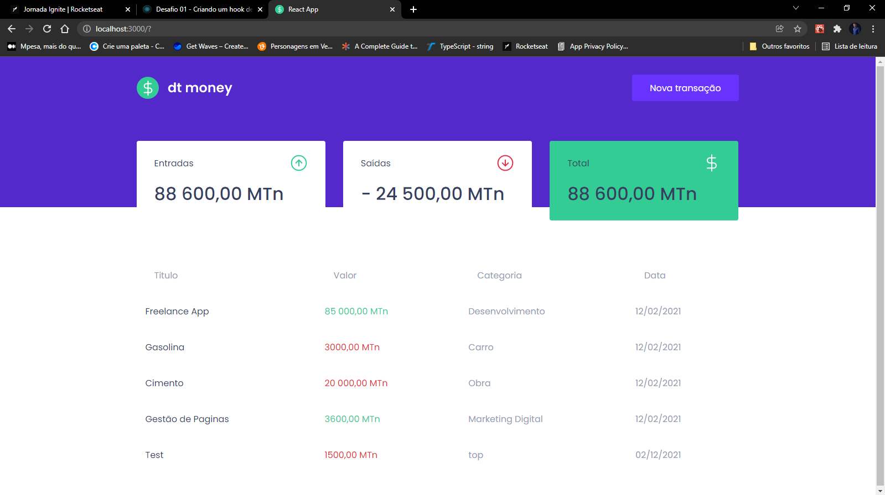

# dtmoney

Aplicação ReactJS desenvolvida durante o modulo 2 do treinamento ignite da Rocketseat, app este voltado para finanças, que ajuda a controlar os gastos e receitas. Com a funcionalidade de lançar as transacções realizadas e calcular os totais, saídas e entradas.

### Habilidades Adquiridas:

* **React-Modal**
* **React useContext**
* **React Hooks - criação de hooks customizados**
* **Fake API com MirageJS**
* **Uso da biblioteca Polished para customização de css com styled-components**
* **Uso de `interface` e `type` para atribuição de tipagem estática com Typescript**

* Entre outras...

Resultado: 
